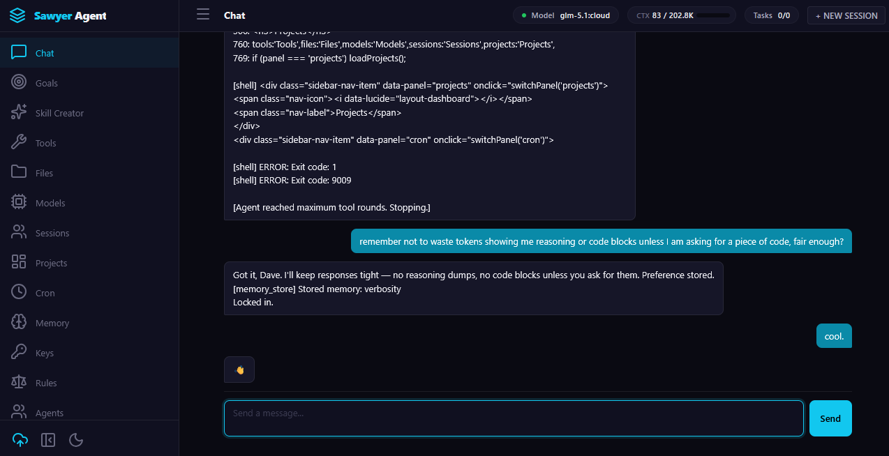

<p align="center">
  
</p>

<h1 align="center">Sawyer Agent</h1>

<p align="center">
  Secure, model-agnostic, self-hosted AI agent framework
</p>

<p align="center">
  <a href="#install"><strong>Install &rarr;</strong></a>
  &nbsp;&middot;&nbsp;
  <a href="#quick-start"><strong>Quick Start &rarr;</strong></a>
  &nbsp;&middot;&nbsp;
  <a href="#tools"><strong>19 Built-in Tools &rarr;</strong></a>
</p>

---

<p align="center">
  
</p>

Sawyer is a standalone AI agent that runs on your machine with no telemetry, no phone-home, and no data leaving your network. It ships with 19 tools, 5 built-in skills, and a ClawHub importer -- connect any OpenAI-compatible LLM and go.

**Principles:** Secure by default. Model-agnostic. Self-hosted. Observable. Self-improving.

## Install

One line:

```bash
pip install git+https://github.com/drc10101/sawyer-harness.git
```

Or clone and install editable:

```bash
git clone https://github.com/drc10101/sawyer-harness.git
cd sawyer-harness
pip install -e .
```

## Quick Start

```bash
# Copy the example config and add your API key
cp config.example.yaml config.yaml

# Start the web UI
sawyer-web --config config.yaml --host 127.0.0.1 --port 8765
```

Open http://127.0.0.1:8765 in your browser.

## Configuration

```yaml
# config.yaml
llm:
  provider: ollama           # ollama, openai, anthropic
  model: glm-5.1:cloud
  api_key: YOUR_KEY_HERE
  base_url: https://ollama.com/v1

server:
  host: 127.0.0.1
  port: 8765
```

## Tools

Sawyer ships with 19 built-in tools. No plugins required:

| Tool | Description |
|------|-------------|
| `shell` | Execute shell commands |
| `file_read` | Read files with line numbers |
| `file_write` | Write/overwrite files |
| `file_search` | Search by filename or content |
| `web_search` | DuckDuckGo search (no API key) |
| `web_fetch` | Fetch and extract text from URLs |
| `code_execute` | Run Python in a sandboxed subprocess |
| `memory_search` | Search persistent memory |
| `memory_store` | Store facts across sessions |
| `memory_delete` | Delete memory entries |
| `skill_search` | Search skills by query |
| `skill_load` | Load a skill's instructions |
| `skill_list` | List all skills |
| `git` | Git operations: status, diff, log, commit, branch, push |
| `patch` | Surgical find/replace file edits |
| `http_request` | REST API calls: GET, POST, PUT, DELETE |
| `clipboard` | Copy text to system clipboard |
| `project_create` | Scaffold new projects from templates |
| `clawhub_import` | Import skills from ClawHub.ai or GitHub |

## Skills

5 built-in skills plus ClawHub import:

| Skill | Description |
|-------|-------------|
| `code-review` | Systematic review with quality gates and security checks |
| `debugging` | 4-phase root cause analysis |
| `tdd` | Red-green-refactor test-driven development |
| `writing-plans` | Actionable implementation plans with bite-sized tasks |
| `git-workflow` | Branching, committing, PR patterns, emergency recovery |

Import any of ClawHub's 68,000+ skills:

```
You: Import the handoff skill from ClawHub
Sawyer: [clawhub_import] Imported 'handoff' -- use skill_load('handoff') to activate it.
```

## Architecture

```
Channel Layer (Telegram, Discord, CLI, Web UI)
        |
   Router/Dispatcher (auth, sessions, rate limit)
        |
    Agent Core
    |-- Memory (SQLite)
    |-- Skills (YAML+Markdown)
    |-- Scheduler (APScheduler)
    |-- Tool Registry (19 tools, sandboxed)
    |-- LLM Client (OpenAI-compatible)
    |-- ClawHub Importer
    +-- Context Manager (token tracking, compression)
```

## License

MIT